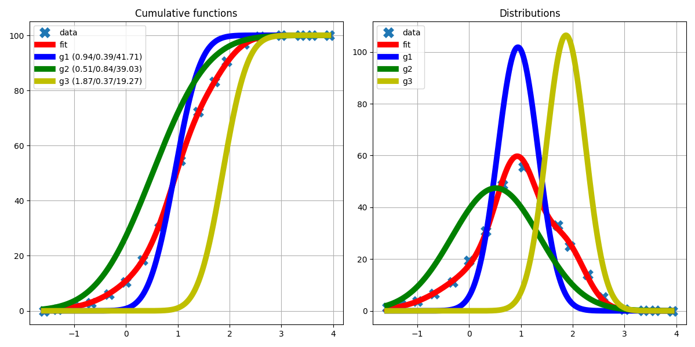

# Grain-Size Distribution Deconvolution Tool

 *(deconvolution example)*

## Overview

This Python tool performs deconvolution of grain-size distributions by fitting a combination of three weighted normal distributions. It's designed for sedimentologists, geologists, and researchers working with granulometric data.

## Features

- Fits three Gaussian distributions to grain-size data
- Provides both cumulative and density distribution visualizations
- Automatic parameter optimization using least squares
- Interactive command-line interface
- Detailed parameter output

## Installation

### Prerequisites

- Python 3.7+
- pip package manager

### Installation Steps

1. Clone the repository:
   ```bash
   git clone https://github.com/nidusfr/lndogs.git
   ```

2. Install dependencies:
   ```bash
   pip install -r requirements.txt
   ```

## Usage

### Basic Command

```bash
python lndogs.py [FILEPATH] [OPTIONS]
```

### Options

| Parameter | Description | Default |
|-----------|-------------|---------|
| `--filepath` | Path to Excel file | `./sample.xlsx` |
| `--column` | Zero-based column index to analyze | `1` |
| `--draw` | Show visualization (True/False) | `True` |

### Example Usage

1. Analyze default column (1) in sample file:
   ```bash
   python lndogs.py
   ```

2. Analyze specific column (0) in custom file:
   ```bash
   python lndogs.py --filepath=data/my_data.xlsx --column=2
   ```

3. Run without visualization:
   ```bash
   python lndogs.py --draw=False
   ```

## Input File Format

The Excel file must contain:

- First column: Grain sizes in phi scale
- Subsequent columns: Cumulative distribution values (0-100%)
- First row is treated as header (ignored)

Example structure:

| Grain Size (ϕ) | Sample 1 | Sample 2 |
|----------------|----------|----------|
| -2.0           | 0.5      | 0.3      |
| -1.5           | 2.1      | 1.8      |
| ...            | ...      | ...      |
| 4.0            | 99.8     | 99.5     |

## Output

The tool provides:

1. Console output with optimized parameters:
   ```
   Best parameters:
   ======================
   mu1    : 1.25
   sigma1 : 0.82
   weight1: 45.32
   ...
   ```

2. (Optional) Visualization showing:
   - Cumulative distributions (left)
   - Probability densities (right)
   - Original data vs. fitted curves

## Customization

You can modify constants in the script to adjust visualization:

```python
LINEWIDTH = 7          # Plot line width
MARKERSIZE = 10        # Data point size
MARKERWIDTH = 5        # Data point edge width
LEGEND_LOCATION = "upper left"  # Legend position
```

## License

[GPL3 License](LICENSE)

## Contributing

Contributions are welcome! Please open an issue or submit a pull request.

## Support

For questions or issues, please open a GitHub issue.
